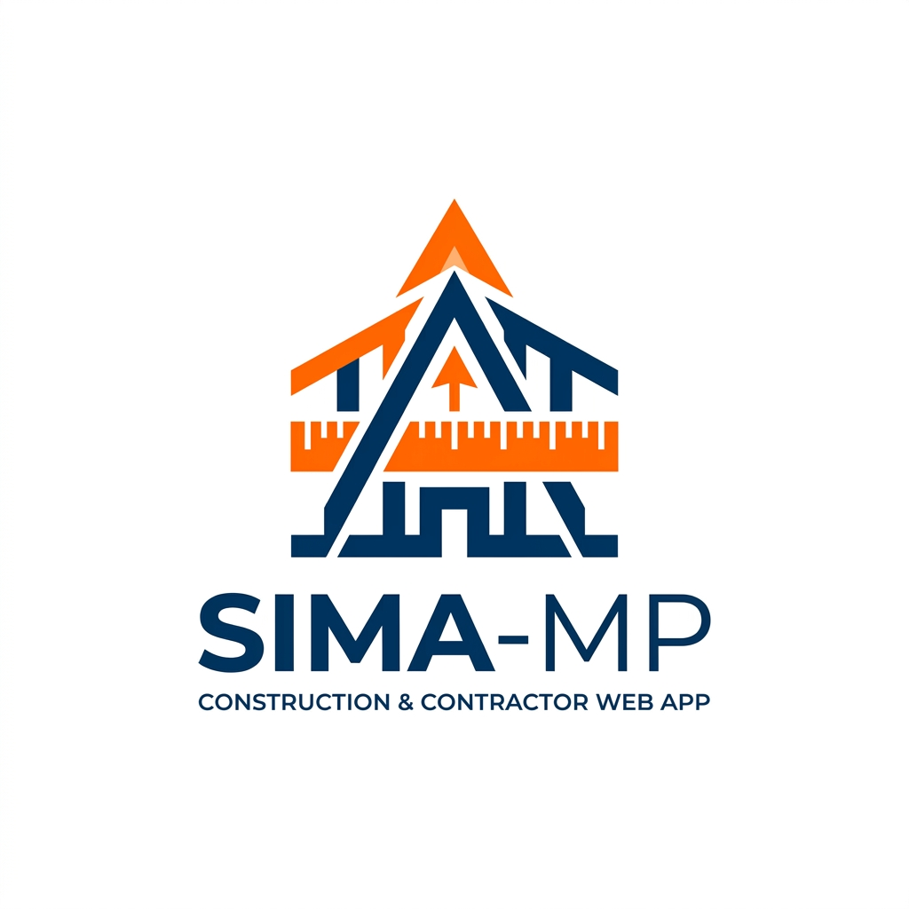

<p align="center">
  
</p>

<h1 align="center">SIMA-MP (Sistem Informasi Manajemen Proyek)</h1>

<p align="center">
  Aplikasi ERP (Enterprise Resource Planning) komprehensif berbasis web untuk mengelola operasional CV/Kontraktor. Mulai dari manajemen proyek, pengawasan inventori, arus kas keuangan, hingga log aktivitas sistem yang terintegrasi penuh.
</p>

<p align="center">
  <a href="#fitur-unggulan">Fitur Utama</a> •
  <a href="#teknologi-yang-digunakan">Teknologi</a> •
  <a href="#panduan-instalasi">Cara Instalasi</a> •
  <a href="#struktur-role-akses">Hak Akses</a>
</p>

---

## 🚀 Fitur Unggulan

Aplikasi SIMA-MP dibangun untuk menyelesaikan kompleksitas bisnis konstruksi dan proyek melalui fitur-fitur yang saling terhubung:

- **🔐 Role-Based Access Control (RBAC)** — Keamanan akses berjenjang (Admin, Manajer, Keuangan) untuk melindungi kerahasiaan data perusahaan.
- **🏗️ Manajemen Proyek Terpadu** — Pantau progress pengerjaan (0-100%), kalkulasi Rencana Anggaran Biaya (RAB) otomatis, serta catat rincian penggunaan material secara real-time.
- **📦 Smart Inventory System** — Dilengkapi notifikasi "*Stok Menipis*", jejak mutasi barang (Riwayat Stok), dan modul Pembelian berantai (otomatis menambah stok, mencatat riwayat masuk, dan memotong saldo keuangan).
- **💰 Manajemen Keuangan & Arus Kas** — Rekapitulasi otomatis total laba rugi, kas/rekening, serta pencatatan terpusat untuk segala pengeluaran material proyek.
- **👥 Hutang & Piutang Karyawan** — Modul lengkap untuk mencatat kasbon/upah kerja karyawan harian proyek, dilengkapi kalkulasi sisa saldo berhutang.
- **📄 Export Laporan PDF** — Unduh laporan profesional untuk Rincian Proyek, Keuangan Bulanan, dan Rekap Rekening Karyawan (di-generate otomatis via DomPDF).
- **🕵️ Audit Trail (Log Aktivitas)** — Transparansi penuh. Semua aksi perubahan data (Create, Update, Delete) oleh setiap entitas otomatis tercatat lengkap beserta IP address.
- **⚙️ Konfigurasi Dinamis** — Modul Pengaturan untuk mengkustomisasi informasi perusahaan (Nama CV, Alamat, Email, Kop Surat Laporan) langsung dari layar dashboard tanpa menyentuh *source code*.

## 🛠 Teknologi yang Digunakan

Proyek ini dibangun menggunakan *stack* web modern dan stabil:

*   **Backend:** [Laravel v12.x](https://laravel.com/) (PHP 8.2+)
*   **Frontend UI:** [AdminKit](https://adminkit.io/) (Bootstrap 5 HTML Framework) + Feather Icons
*   **Database:** MySQL / MariaDB
*   **Libraries:** 
    *   `barryvdh/laravel-dompdf` (Generasi Dokumen Laporan)
    *   DataTables (Tabel iteraktif, responsif, dan terpaginasi)

## 👤 Struktur Role & Akses

| Modul | Admin | Manajer Proyek | Staff Keuangan |
| :--- | :---: | :---: | :---: |
| **Dashboard** | ✅ | ✅ | ✅ |
| **Profil Akun** | ✅ | ✅ | ✅ |
| **Manage Users & Role** | ✅ | ❌ | ❌ |
| **Karyawan & Klien** | ✅ | ✅ | ❌ |
| **Stok & Pembelian** | ✅ | ✅ | ❌ |
| **Manajemen Proyek** | ✅ | ✅ | ❌ |
| **Keuangan & Kas** | ✅ | ❌ | ✅ |
| **Hutang-Piutang (Kasbon)** | ✅ | ❌ | ✅ |
| **Log Aktivitas & Setting** | ✅ | ❌ | ❌ |

## 💻 Panduan Instalasi (Development)

Untuk menjalankan proyek ini di mesin lokal Anda (Windows/Mac/Linux):

1. **Clone repositori**
   ```bash
   git clone https://github.com/username-anda/sima-mp-laravel.git
   cd sima-mp-laravel
   ```

2. **Install dependensi & Vendor**
   ```bash
   composer install
   npm install && npm run build
   ```

3. **Duplikat file Environment**
   ```bash
   cp .env.example .env
   php artisan key:generate
   ```

4. **Konfigurasi Database**
   Buka file `.env` kamu, lalu sesuaikan kredensial base data (contoh MySQL):
   ```env
   DB_CONNECTION=mysql
   DB_HOST=127.0.0.1
   DB_PORT=3306
   DB_DATABASE=db_sima_mp_laravel12
   DB_USERNAME=root
   DB_PASSWORD=
   ```

5. **Migrate dan Seed Database**
   Langkah ini sangat penting untuk membangun kerangka tabel dan memberikan sample *dummy data* untuk demo.
   ```bash
   php artisan migrate:fresh --seed
   ```

6. **Jalankan Aplikasi**
   ```bash
   php artisan serve
   ```
   Akses `http://localhost:8000` di browser.

### Kredensial Login Bawaan (Demo)

*   **Admin:** `admin@mail.com` | Password: `password`
*   **Manajer:** `manajer@mail.com` | Password: `password`
*   **Keuangan:** `keuangan@mail.com` | Password: `password`

---

<p align="center">
  Dibuat dengan 💻 menggunakan framework Laravel.
</p>
